<div align="center">
  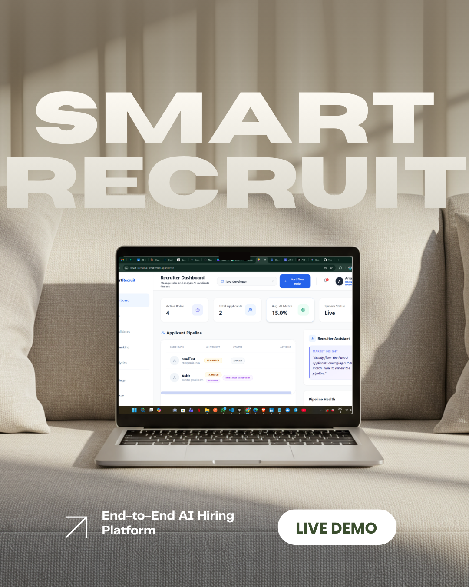

  <br />
  <br />

  # 🚀 Smart Recruit AI 
  **Intelligent End-to-End Hiring Pipeline & Automated ATS**

  <p align="center">
    
    
    
  </p>

  <p align="center">
    <a href="https://smart-recruit-ai-weld.vercel.app"><b>✨ View Live Demo</b></a> •
    <a href="https://smart-recruit-ai-8toz.onrender.com"><b>📂 Backend API</b></a> •
    <a href="#-getting-started"><b>🛠️ Setup Guide</b></a>
  </p>
</div>

---

## 🌍 The Vision
Traditional hiring is broken. Recruiters receive thousands of resumes, making manual screening impossible, while candidates wait weeks for feedback. 

**Smart Recruit AI** solves this by introducing a multi-layered, AI-driven filtering ecosystem. It doesn't just collect applications; it calculates exact match rates, conducts automated AI pre-interviews, and provides actionable, data-driven feedback reports to human HRs.


## ⚙️ Core System Architecture

Traditional hiring is slow. **Smart Recruit AI** automates the pipeline, reducing recruiter workload by 80% while giving instant progress updates to candidates.

<div align="center">
  
</div>

### 🔄 The AI Hiring Flow:
1. **Job Deployment:** Recruiter posts a job opening on the platform.
2. **Application Phase:** Candidates apply through their portal.
3. **AI Parsing & Match Rate:** The AI engine scans the resume against the Job Description, calculating a precise Match Rate %.
4. **Shortlisting:** Recruiters view the Match Rate and trigger the next round.
5. **AI Automated Interview:** Shortlisted candidates take an AI-driven interview.
6. **Feedback Generation:** AI analyzes responses and sends a detailed feedback report to the recruiter.
7. **Final HR Round:** Recruiters schedule the final human interview based on AI feedback.

---

## 📸 Feature Walkthrough

### 🔐 1. Smart Role-Based Authentication
Secure, state-preserved routing ensuring candidates and recruiters land on their dedicated portals without OAuth role-mismatch conflicts.
<div align="center">
  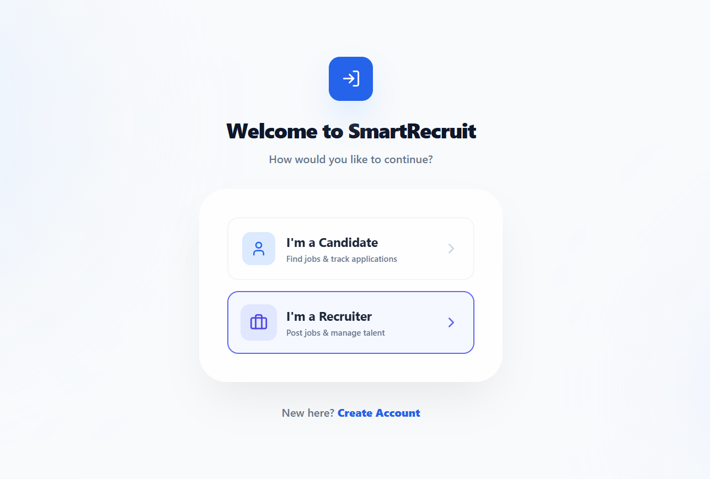
</div>
<br/>

### 🏢 2. The Recruiter Command Center
A powerful, high-level dashboard to track active job listings, monitor total applicants, and gauge overall system metrics at a glance.
<div align="center">
  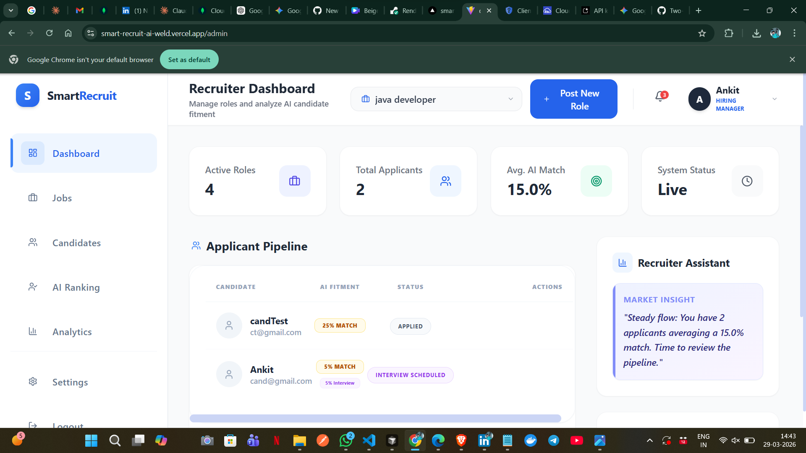
</div>
<br/>

### 🎯 3. The Candidate Career Portal
A personalized hub for job seekers to discover AI-matched roles, view total applications, and navigate their hiring journey with ease.
<div align="center">
  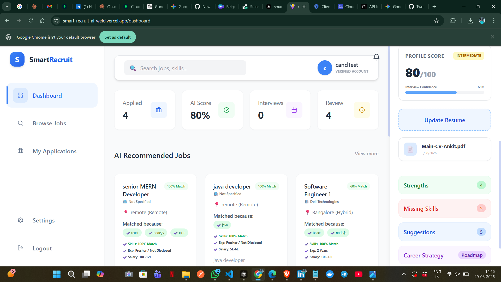
</div>
<br/>

### 🧠 4. AI Profile Parsing & Match Rates
Instantaneous resume analysis generating a precise Match Rate % and skill breakdown to help recruiters make faster shortlisting decisions.
<div align="center">
  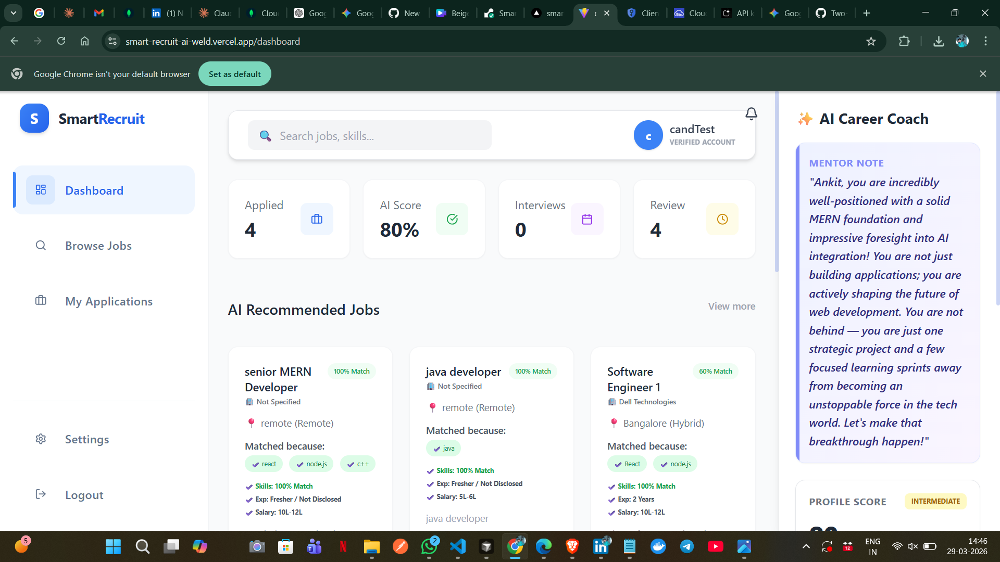
  
</div>
<br/>

### 🔔 5. Real-Time Application Tracking
Live status updates and comprehensive tracking, allowing candidates to see exactly where they stand—from "Applied" to "Shortlisted".
<div align="center">
  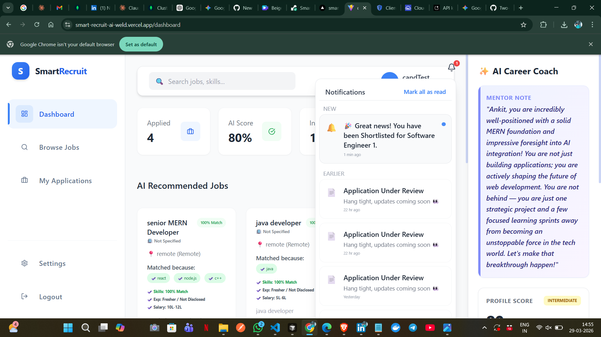
</div>
<br/>

### 🤖 6. Automated AI Mock Interviews
A dynamic, automated interface where shortlisted candidates interact with an AI-driven system for their initial technical and behavioral screening.
<div align="center">
  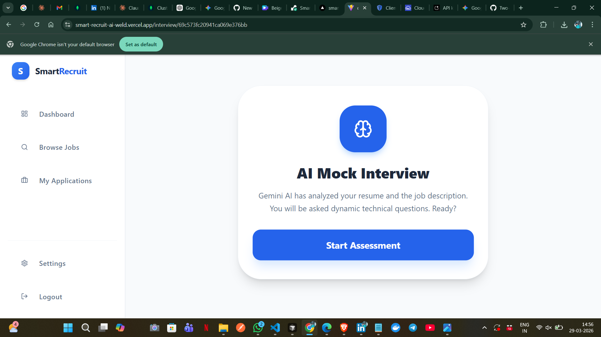
</div>
<br/>

### 📈 7. Candidate's AI Feedback Report
Detailed, AI-generated performance feedback provided directly to the candidate after their mock interview, highlighting strengths and areas to improve.
<div align="center">
  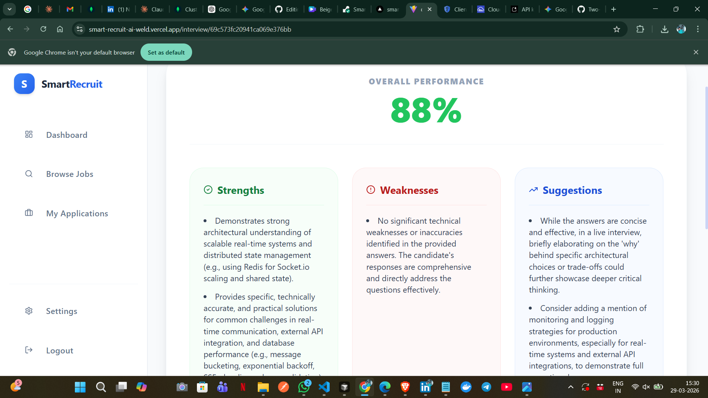
</div>
<br/>

### 📋 8. Recruiter's AI Assessment View
Comprehensive evaluation reports allowing recruiters to review a candidate's AI interview performance and make data-driven progression decisions.
<div align="center">
  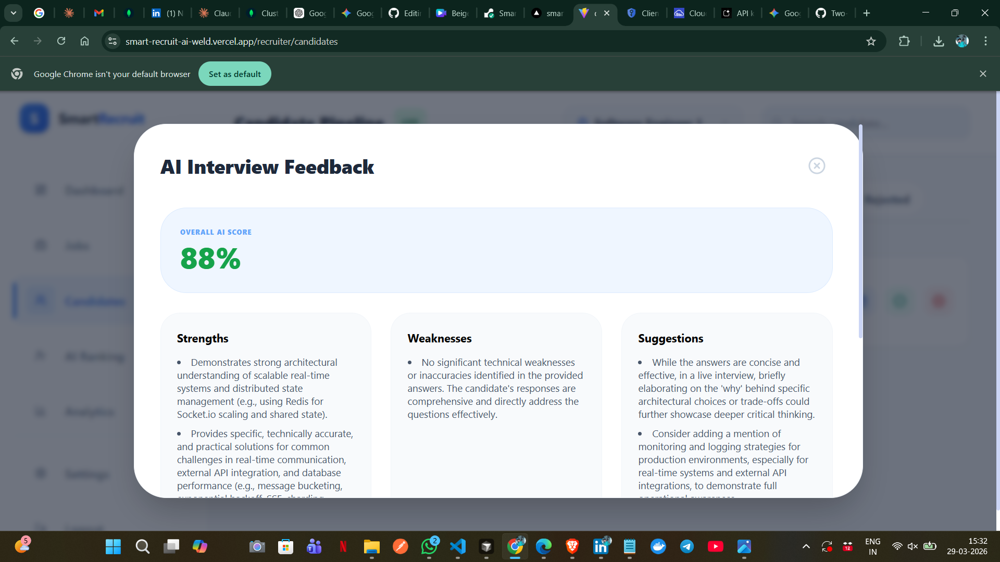
</div>
<br/>

### 📅 9. Seamless HR Interview Scheduling
One-click scheduling tools for recruiters to effortlessly invite top-performing, AI-vetted candidates to the final human-led interview round.
<div align="center">
  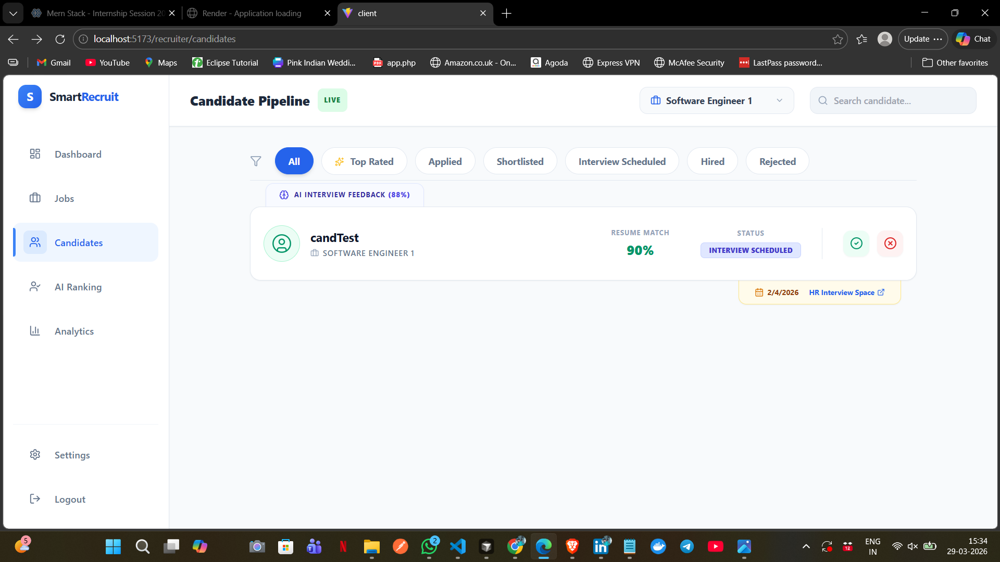
</div>
<br/>

### 📹 10. Candidate Interview Lobby
A streamlined access point for candidates to view their scheduled time slots and seamlessly join their final HR video interviews.
<div align="center">
  
</div>
<br/>

### 👤 11. Comprehensive Candidate Profiles
Detailed digital portfolios where candidates can easily manage their personal information, update resumes, and showcase their skills.
<div align="center">
  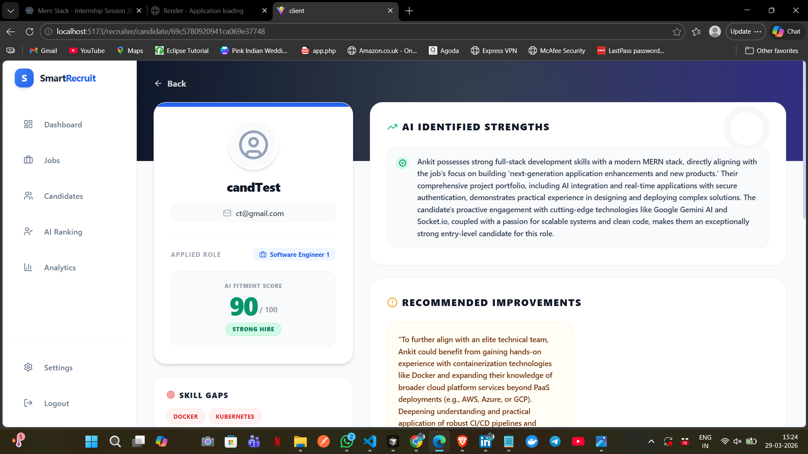
</div>
<br/>

### 📊 12. Recruitment Analytics & Insights
Visual data representations tracking hiring metrics, pipeline health, and applicant conversion rates to optimize the recruitment strategy.
<div align="center">
  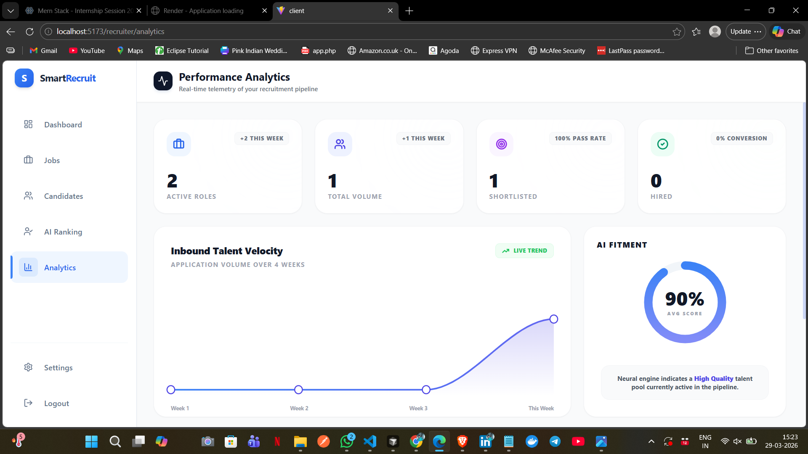
</div>
<br/>

### 👥 13. Applicant Pipeline Management
Organized, filterable tables of applied candidates allowing recruiters to easily track statuses, view match rates, and move talent through the funnel.
<div align="center">
  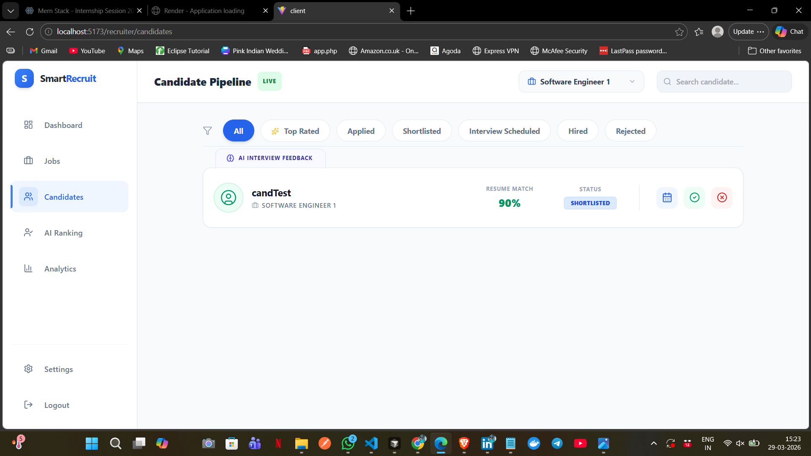
</div>
<br/>

### 💼 14. Active Job Postings Management
A dedicated control center for recruiters to create new opportunities, edit requirements, and monitor deployed job roles across the platform.
<div align="center">
  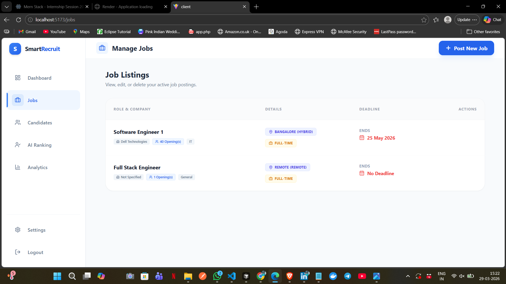
</div>
<br/>


---

## 🎉 Ready to Experience It Live?

While this documentation covers the core architecture and setup, the real magic happens on the platform. I invite you to create a test account, upload a resume to see the AI parsing in action, or experience the automated interview portal firsthand!

**👉 [Click here to explore Smart Recruit AI](https://smart-recruit-ai.vercel.app)**

---


## 🧠 Engineering Highlight: The OAuth Role Fix

One of the major technical challenges in this project was handling **Role-Based Access Control (RBAC)** during third-party authentication.

**❌ The Problem:** Standard Google OAuth doesn't natively know if a user is signing up as a *Candidate* or a *Recruiter*. If a recruiter accidentally logged in via the candidate portal, the system would assign the wrong default role.

**✅ The Solution:** I implemented a robust state-preservation mechanism using query parameters. 
1. The frontend explicitly passes the intended role: `/api/auth/google?role=recruiter`
2. The backend intercepts this query and preserves it during the Google handshake.
3. Upon successful callback, the system verifies the role, creates the correct database schema, and routes the user to their specific dashboard (`/admin` vs `/dashboard`).

---

## 💻 Tech Stack Ecosystem

| Frontend 🎨 | Backend ⚙️ | Database 🗄️ | AI & Tools 🧠 |
| :--- | :--- | :--- | :--- |
| **React.js (Vite)** | **Node.js** | **MongoDB Atlas** | **Google Gemini AI** |
| Tailwind CSS | Express.js | Mongoose ODM | Passport.js (OAuth) |
| React Router v6 | JWT Authentication | | Axios |
| Lucide Icons | REST API | | Git & GitHub |

---

Want to run this project locally? Follow these steps:

### 1️⃣ Clone the repository
```bash
git clone [https://github.com/ankit18193/SmartRecruit-AI.git](https://github.com/ankit18193/SmartRecruit-AI.git)
cd SmartRecruit-AI

```

2️⃣ Configure Environment Variables
Create a .env file in the server directory and add your credentials:

Code snippet
PORT=5000
MONGO_URI=your_mongodb_atlas_uri
JWT_SECRET=your_super_secret_key
GOOGLE_CLIENT_ID=your_id
GOOGLE_CLIENT_SECRET=your_secret
GOOGLE_CALLBACK_URL=http://localhost:5000/api/auth/google/callback
FRONTEND_URL=http://localhost:5173
3️⃣ Installation & Running
Open two separate terminals:

Terminal 1: Backend

```bash
cd server
npm install
npm run dev
Terminal 2: Frontend
```
```bash
cd client
npm install
npm run dev
```

🔌 API Endpoints Reference
------------------------------

Method     |      Endpoint                    |   Description
-------------------------------------------------------------------------
POST       |    /api/auth/register            |  Register new user
POST       |    /api/auth/login               |  Login & receive JWT
GET        |    /api/jobs                     |  Get all job listings
POST       |    /api/jobs                     |  Create a new job (Recruiter)
GET        |    /api/applications/user        |  Get candidate's applications
POST       |    /api/interviews/start/:jobId  |  Trigger AI Interview
---------------------------------------------------------------------------

--------------
👨‍💻 Author
ANKIT KUMAR YADAV
Full Stack MERN Developer | CSE Student (4th Year)


